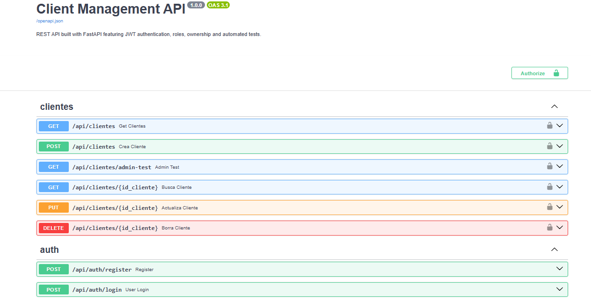

# FastAPI Client Management API

A REST API built with **FastAPI** that demonstrates authentication, authorization, resource ownership, validation, automated testing, and backend development best practices.

---

# Preview

> **Swagger UI Preview**



---

# Live Demo

🔗 **Swagger UI**

https://client-management-api-hhpj.onrender.com/docs

> **Note:** This API is deployed on Render's free tier. The first request after a period of inactivity may take a few seconds while the service starts.

---

# API Features

* User registration
* JWT authentication
* Protected endpoints
* Role-Based Access Control (RBAC)
* Resource ownership validation
* Full CRUD operations
* Filtering by name and age
* Pagination
* Sorting
* Input validation with Pydantic
* Automated testing

---

# Authentication & Security

* User registration
* JWT authentication
* Password hashing with bcrypt
* Protected endpoints
* Environment variable configuration

---

# Authorization

* Role-Based Access Control (RBAC)
* User and Administrator roles
* Resource ownership validation

---

# Client Management

* Create, Read, Update and Delete clients
* Filtering by name and age
* Pagination
* Sorting
* Input validation

---

# Testing

The project includes a comprehensive automated test suite built with **Pytest**.

### Test Coverage

* **96% total code coverage**

### Covered Scenarios

* Authentication
* Authorization
* Ownership validation
* CRUD operations
* Filtering
* Pagination
* Sorting
* Validation errors
* Security
* Coverage reporting with `pytest-cov`

---

# Tech Stack

* Python 3
* FastAPI
* SQLite
* Pydantic v2
* JWT (`python-jose`)
* Passlib (`bcrypt`)
* Uvicorn
* Pytest
* pytest-cov
* python-dotenv

---

# Architecture

The project follows a layered architecture to keep responsibilities separated and the codebase maintainable.

* **Routes** – Handle HTTP requests and responses.
* **Services** – Business logic implementation.
* **Dependencies** – Authentication and authorization dependencies.
* **Security** – JWT generation, validation and password hashing.
* **Models** – Pydantic request and response models.
* **Database** – SQLite connection and database initialization.

---

# Project Structure

```text
.
├── dependencies/
├── routes/
├── services/
├── tests/
├── db.py
├── main.py
├── models.py
├── security.py
├── requirements.txt
├── .env.example
└── README.md
```

---

# Installation

Clone the repository:

```bash
git clone <repository-url>
cd client-management-api
```

Create a virtual environment:

```bash
python -m venv .venv
```

Activate the virtual environment.

**Windows**

```bash
.venv\Scripts\activate
```

**Linux / macOS**

```bash
source .venv/bin/activate
```

Install the dependencies:

```bash
pip install -r requirements.txt
```

Create your environment file.

**Windows**

```bash
copy .env.example .env
```

**Linux / macOS**

```bash
cp .env.example .env
```

---

# Environment Variables

Configure the following variables inside your `.env` file.

```env
SECRET_KEY=your-secret-key
ALGORITHM=HS256
ACCESS_TOKEN_EXPIRE_MINUTES=30
DATABASE_URL=data/clientes.db
```

---

# Running the Application

## Development

```bash
uvicorn main:app --reload
```

Swagger documentation:

```text
http://127.0.0.1:8000/docs
```

---

## Production

```bash
uvicorn main:app --host 0.0.0.0 --port $PORT
```

---

# Authentication in Swagger

To access protected endpoints:

1. Register a new user.
2. Log in using `/api/auth/login`.
3. Copy the generated JWT access token.
4. Click the **Authorize** button in Swagger.
5. Paste the token.
6. You can now access all protected endpoints.

---

# Running Tests

Run all tests:

```bash
pytest
```

Generate a coverage report:

```bash
pytest --cov=. --cov-report=term-missing
```

---

# Learning Objectives

This project was built to practice and consolidate the following backend development concepts:

* REST API development
* FastAPI architecture
* JWT authentication
* Authorization and RBAC
* Resource ownership
* Input validation with Pydantic
* Automated testing with Pytest
* Environment management
* Git & GitHub workflow
* Deployment with Render
* Backend development best practices

---

# Future Improvements

* PostgreSQL integration
* SQLAlchemy ORM
* Alembic database migrations
* Docker containerization
* CI/CD with GitHub Actions
* API versioning
* Rate limiting
* Refresh token authentication

---

# License

This project was created for educational purposes as part of a backend learning roadmap focused on Python and FastAPI.
